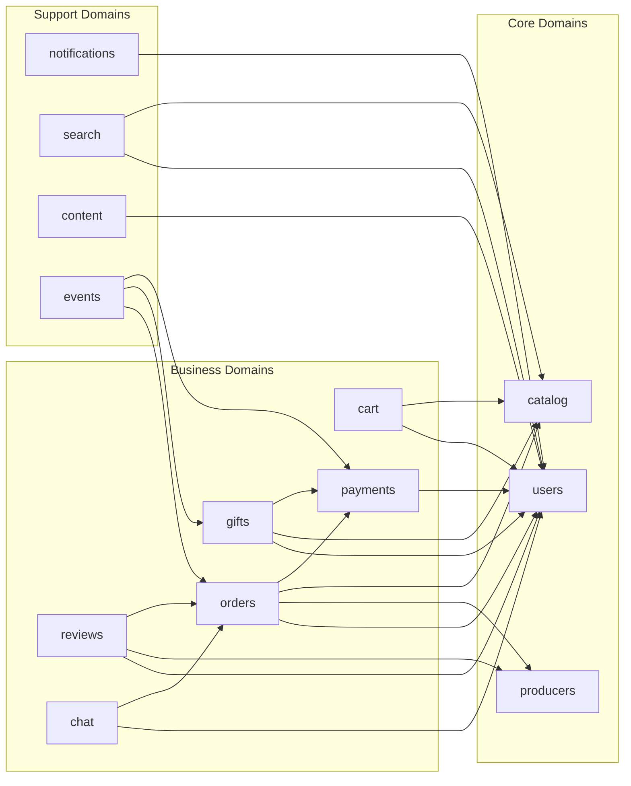

# Архитектурный план реорганизации проекта food-home

## 1. Анализ текущей архитектуры

### 1.1 Текущая структура Backend

**Проблемы:**
- **Монолитное приложение**: Все модели, сериализаторы и представления находятся в одном приложении `api/`
- **Масштабируемость**: Файл [`models.py`](backend/api/models.py) содержит ~1300 строк с 30+ моделями
- **Связность**: Сильная связность между несвязанными доменами (например, `Producer` и `GiftOrder` в одном файле)
- **Тестируемость**: Сложно тестировать отдельные домены в изоляции
- **Поддержка**: Любые изменения требуют пересборки всего приложения

**Выявленные доменные области:**

| Домен | Модели | Сервисы | Описание |
|-------|--------|---------|----------|
| **Users** | User, Profile, Address, UserDevice, VerificationCode, PendingRegistration, PendingChange | - | Управление пользователями, аутентификация |
| **Producers** | Producer, Payout | - | Продавцы, финансы продавцов |
| **Catalog** | Category, Dish, DishImage, DishTopping, PromoCode | recommendation_service | Каталог блюд, категории |
| **Orders** | Order, OrderDraft | order_service, order_finance_service, sla_service, penalties | Заказы, черновики заказов |
| **Cart** | Cart, CartItem | cart_service | Корзина покупок |
| **Payments** | Payment, PaymentMethod | payment_service, payment_providers | Платежи, способы оплаты |
| **Gifts** | GiftOrder, GiftProduct, GiftPayment, GiftActivationAttempt, GiftActivationIdempotency, GiftCreateIdempotency, RefundOperation | gift_service | Подарки, сертификаты |
| **Reviews** | Review, Dispute | review_service, dispute_service | Отзывы, споры |
| **Chat** | ChatMessage, ChatComplaint | chat_service | Чаты, жалобы |
| **Notifications** | Notification | notifications | Уведомления |
| **Search** | SearchHistory, SavedSearch, FavoriteDish | - | Поиск, избранное |
| **Content** | HelpArticle | - | Помощь, FAQ |
| **Events** | OutboxEvent, PublishedEvent | - | Outbox паттерн для событий |

### 1.2 Текущая структура Frontend

**Проблемы:**
- **Смешанная организация**: Компоненты организованы по типам (components/, hooks/, services/) и по доменам (components/home/, components/chat/)
- **Дублирование**: Несколько версий похожих компонентов (например, [`DishCard.tsx`](components/DishCard.tsx) и [`components/dish/DishCard.tsx`](components/dish/DishCard.tsx))
- **Отсутствие barrel exports**: Нет централизованных экспортов для доменов
- **Сложные пути**: Глубокая вложенность компонентов

**Выявленные доменные области Frontend:**

| Домен | Компоненты | Хуки | Сервисы |
|-------|-----------|-------|---------|
| **Auth** | auth/* | - | - |
| **Catalog** | dishes/*, categories/* | - | - |
| **Cart** | cart/*, CartActions.tsx, CartMenu.tsx | useCart.ts | - |
| **Orders** | orders/*, OrderCard.tsx, checkout/* | useOrderDraft.ts | - |
| **Payments** | PaymentMethodsModal.tsx, checkout/* | - | - |
| **Gifts** | my-gifts/*, gift-details/*, loyalty/* | - | - |
| **Reviews** | reviews/* | - | - |
| **Chat** | chat/*, ChatWithArchive.tsx, GlobalChat.tsx | useChat.ts | - |
| **Profile** | profile/*, ProfileMenu.tsx, settings/* | - | - |
| **Seller** | seller/* | - | - |
| **Search** | search/*, SearchBar.tsx, SearchAutocomplete.tsx | useSearch.ts | - |
| **UI** | ui/* | - | pushNotificationService.ts |

---

## 2. Предложенная новая структура Backend

### 2.1 Общая структура директорий

```
backend/
├── apps/                          # Django приложения по доменам
│   ├── users/                     # Домен пользователей
│   ├── producers/                 # Домен продавцов
│   ├── catalog/                   # Домен каталога
│   ├── orders/                    # Домен заказов
│   ├── cart/                      # Домен корзины
│   ├── payments/                  # Домен платежей
│   ├── gifts/                     # Домен подарков
│   ├── reviews/                   # Домен отзывов
│   ├── chat/                      # Домен чатов
│   ├── notifications/             # Домен уведомлений
│   ├── search/                    # Домен поиска
│   ├── content/                   # Домен контента
│   └── events/                    # Домен событий (outbox)
│
├── api/                           # API роутинг и версии
│   └── v1/
│       ├── urls.py                # Главный роутер API v1
│       └── __init__.py
│
├── core/                          # Общая инфраструктура (сохраняется)
│   ├── auth.py
│   ├── cache.py
│   ├── permissions.py
│   ├── responses.py
│   ├── pagination.py
│   ├── filters.py
│   ├── validators.py
│   ├── exceptions.py
│   ├── exceptions_handler.py
│   ├── middleware.py
│   ├── logging.py
│   ├── tasks.py
│   ├── data_validation.py
│   ├── migrations_utils.py
│   └── safe_file_reader.py
│
├── shared/                        # Общие модели и утилиты между доменами
│   ├── models/
│   │   ├── base.py                # Базовые абстрактные модели
│   │   └── mixins.py              # Миксины моделей
│   ├── services/
│   │   └── base_service.py        # Базовый класс сервисов
│   └── utils/
│       ├── geo.py                 # Геолокация
│       └── phone.py               # Валидация телефонов
│
├── backend/                       # Конфигурация Django
│   ├── settings/
│   │   ├── base.py
│   │   ├── development.py
│   │   ├── staging.py
│   │   └── production.py
│   ├── urls.py
│   ├── wsgi.py
│   └── asgi.py
│
├── templates/                     # Шаблоны (сохраняется)
│   └── emails/
│
└── manage.py
```

### 2.2 Структура каждого Django App

Каждое приложение следует единому шаблону:

```
apps/{domain}/
├── __init__.py
├── apps.py                        # Конфигурация приложения
├── models.py                      # Модели домена
├── managers.py                    # Custom QuerySets и Managers
├── signals.py                     # Django signals
├── admin.py                       # Django admin конфигурация
├── migrations/                    # Миграции
│   └── ...
├── services/                      # Бизнес-логика домена
│   ├── __init__.py
│   └── {domain}_service.py
├── api/                           # API слой домена
│   ├── __init__.py
│   ├── urls.py                    # URL роутинг домена
│   ├── serializers.py             # Сериализаторы
│   ├── views.py                   # API ViewSets и Views
│   ├── permissions.py            # Пермиссии домена
│   ├── filters.py                 # Фильтры
│   └── validators.py              # Валидаторы
└── tasks.py                       # Celery задачи (если есть)
```

### 2.3 Детальное распределение моделей по приложениям

#### **apps/users/** - Домен пользователей

**Модели:**
- `User` (из django.contrib.auth, расширенный)
- `Profile`
- `Address`
- `UserDevice`
- `VerificationCode`
- `PendingRegistration`
- `PendingChange`

**API endpoints:**
- `/api/v1/users/me/` - профиль текущего пользователя
- `/api/v1/users/addresses/` - адреса пользователя
- `/api/v1/users/devices/` - устройства пользователя
- `/api/v1/auth/register/` - регистрация
- `/api/v1/auth/login/` - вход
- `/api/v1/auth/logout/` - выход
- `/api/v1/auth/verify/` - верификация
- `/api/v1/auth/change-email/` - смена email
- `/api/v1/auth/change-phone/` - смена телефона
- `/api/v1/auth/change-password/` - смена пароля

#### **apps/producers/** - Домен продавцов

**Модели:**
- `Producer`
- `Payout`

**API endpoints:**
- `/api/v1/producers/` - список продавцов
- `/api/v1/producers/{id}/` - детальная информация
- `/api/v1/producers/me/` - профиль продавца (текущий)
- `/api/v1/producers/me/payouts/` - выплаты продавца
- `/api/v1/producers/{id}/schedule/` - расписание
- `/api/v1/producers/{id}/delivery-zones/` - зоны доставки

#### **apps/catalog/** - Домен каталога

**Модели:**
- `Category`
- `Dish`
- `DishImage`
- `DishTopping`
- `PromoCode`

**API endpoints:**
- `/api/v1/categories/` - категории
- `/api/v1/categories/{id}/dishes/` - блюда категории
- `/api/v1/dishes/` - список блюд
- `/api/v1/dishes/{id}/` - детальная информация о блюде
- `/api/v1/dishes/{id}/images/` - изображения блюда
- `/api/v1/dishes/{id}/toppings/` - топпинги блюда
- `/api/v1/dishes/{id}/reviews/` - отзывы о блюде
- `/api/v1/promo-codes/` - промокоды

#### **apps/orders/** - Домен заказов

**Модели:**
- `Order`
- `OrderDraft`

**Сервисы:**
- `order_service.py` - бизнес-логика заказов
- `order_finance_service.py` - финансовые операции
- `sla_service.py` - SLA контроль
- `penalties.py` - штрафы

**API endpoints:**
- `/api/v1/orders/` - список заказов
- `/api/v1/orders/{id}/` - детальная информация
- `/api/v1/orders/{id}/cancel/` - отмена заказа
- `/api/v1/orders/{id}/accept/` - принятие заказа (продавец)
- `/api/v1/orders/{id}/ready/` - заказ готов
- `/api/v1/orders/{id}/deliver/` - доставка
- `/api/v1/orders/{id}/complete/` - завершение
- `/api/v1/orders/{id}/reschedule/` - переназначение времени
- `/api/v1/order-drafts/` - черновики заказов
- `/api/v1/orders/{id}/reorder/` - повтор заказа

#### **apps/cart/** - Домен корзины

**Модели:**
- `Cart`
- `CartItem`

**Сервисы:**
- `cart_service.py`

**API endpoints:**
- `/api/v1/cart/` - корзина текущего пользователя
- `/api/v1/cart/items/` - элементы корзины
- `/api/v1/cart/clear/` - очистка корзины

#### **apps/payments/** - Домен платежей

**Модели:**
- `Payment`
- `PaymentMethod`

**Сервисы:**
- `payment_service.py`
- `payment_providers.py`

**API endpoints:**
- `/api/v1/payments/` - платежи
- `/api/v1/payments/{id}/` - детальная информация
- `/api/v1/payments/{id}/refund/` - возврат
- `/api/v1/payment-methods/` - способы оплаты пользователя
- `/api/v1/payment-methods/{id}/set-default/` - установить по умолчанию

#### **apps/gifts/** - Домен подарков

**Модели:**
- `GiftOrder`
- `GiftProduct`
- `GiftPayment`
- `GiftActivationAttempt`
- `GiftActivationIdempotency`
- `GiftCreateIdempotency`
- `RefundOperation`

**Сервисы:**
- `gift_service.py`

**API endpoints:**
- `/api/v1/gifts/` - подарки пользователя
- `/api/v1/gifts/create/` - создание подарка
- `/api/v1/gifts/{id}/` - детальная информация
- `/api/v1/gifts/{code}/preview/` - предпросмотр подарка
- `/api/v1/gifts/{code}/activate/` - активация подарка
- `/api/v1/gift-products/` - доступные подарки
- `/api/v1/gift-payments/` - платежи подарков

#### **apps/reviews/** - Домен отзывов

**Модели:**
- `Review`
- `Dispute`

**Сервисы:**
- `review_service.py`
- `dispute_service.py`
- `rating_service.py`

**API endpoints:**
- `/api/v1/reviews/` - отзывы
- `/api/v1/reviews/{id}/` - детальная информация
- `/api/v1/reviews/{id}/update/` - обновление отзыва
- `/api/v1/reviews/{id}/seller-response/` - ответ продавца
- `/api/v1/disputes/` - споры
- `/api/v1/disputes/{id}/` - детальная информация
- `/api/v1/disputes/{id}/resolve/` - решение спора

#### **apps/chat/** - Домен чатов

**Модели:**
- `ChatMessage`
- `ChatComplaint`

**Сервисы:**
- `chat_service.py`

**API endpoints:**
- `/api/v1/chats/` - чаты пользователя
- `/api/v1/chats/{order_id}/messages/` - сообщения чата
- `/api/v1/chats/{order_id}/messages/{id}/read/` - отметить прочитанным
- `/api/v1/chat-complaints/` - жалобы на чаты

#### **apps/notifications/** - Домен уведомлений

**Модели:**
- `Notification`

**Сервисы:**
- `notifications.py`

**API endpoints:**
- `/api/v1/notifications/` - уведомления пользователя
- `/api/v1/notifications/{id}/read/` - отметить прочитанным
- `/api/v1/notifications/read-all/` - отметить все прочитанными

#### **apps/search/** - Домен поиска

**Модели:**
- `SearchHistory`
- `SavedSearch`
- `FavoriteDish`

**Сервисы:**
- `recommendation_service.py`
- `referral_service.py`

**API endpoints:**
- `/api/v1/search/` - поиск
- `/api/v1/search/history/` - история поиска
- `/api/v1/search/saved/` - сохраненные поиски
- `/api/v1/favorites/` - избранные блюда
- `/api/v1/favorites/{id}/` - добавить/удалить из избранного

#### **apps/content/** - Домен контента

**Модели:**
- `HelpArticle`

**API endpoints:**
- `/api/v1/help/` - статьи помощи
- `/api/v1/help/{id}/` - детальная информация

#### **apps/events/** - Домен событий (Outbox)

**Модели:**
- `OutboxEvent`
- `PublishedEvent`

**Management commands:**
- `process_outbox_events.py`
- `cleanup_outbox_events.py`

### 2.4 Структура API роутинга

```python
# api/v1/urls.py
from django.urls import path, include
from rest_framework.routers import DefaultRouter

router = DefaultRouter()

# Users
router.register(r'users/addresses', users.api.views.AddressViewSet)
router.register(r'users/devices', users.api.views.UserDeviceViewSet)

# Producers
router.register(r'producers', producers.api.views.ProducerViewSet)

# Catalog
router.register(r'categories', catalog.api.views.CategoryViewSet)
router.register(r'dishes', catalog.api.views.DishViewSet)

# Orders
router.register(r'orders', orders.api.views.OrderViewSet)
router.register(r'order-drafts', orders.api.views.OrderDraftViewSet)

# Cart
router.register(r'cart', cart.api.views.CartViewSet)

# Payments
router.register(r'payments', payments.api.views.PaymentViewSet)
router.register(r'payment-methods', payments.api.views.PaymentMethodViewSet)

# Gifts
router.register(r'gifts', gifts.api.views.GiftOrderViewSet)
router.register(r'gift-products', gifts.api.views.GiftProductViewSet)

# Reviews
router.register(r'reviews', reviews.api.views.ReviewViewSet)
router.register(r'disputes', reviews.api.views.DisputeViewSet)

# Chat
router.register(r'chats', chat.api.views.ChatViewSet)

# Notifications
router.register(r'notifications', notifications.api.views.NotificationViewSet)

# Search
router.register(r'search', search.api.views.SearchViewSet)
router.register(r'favorites', search.api.views.FavoriteDishViewSet)
router.register(r'saved-searches', search.api.views.SavedSearchViewSet)

# Content
router.register(r'help', content.api.views.HelpArticleViewSet)

urlpatterns = [
    path('auth/', include('users.api.urls')),
    path('', include(router.urls)),
]
```

---

## 3. Предложенная новая структура Frontend

### 3.1 Общая структура директорий

```
frontend/
├── src/
│   ├── app/                        # Next.js App Router страницы
│   │   ├── (main)/                 # Основная группа маршрутов
│   │   │   ├── layout.tsx
│   │   │   ├── page.tsx
│   │   │   ├── auth/
│   │   │   ├── catalog/
│   │   │   ├── orders/
│   │   │   ├── cart/
│   │   │   ├── gifts/
│   │   │   ├── profile/
│   │   │   ├── search/
│   │   │   └── help/
│   │   ├── (seller)/               # Продавецская группа маршрутов
│   │   │   ├── layout.tsx
│   │   │   └── seller/
│   │   └── api/                    # API routes
│   │
│   ├── features/                   # Feature-based организация
│   │   ├── auth/                   # Auth feature
│   │   │   ├── components/         # Auth компоненты
│   │   │   ├── hooks/              # Auth хуки
│   │   │   ├── services/           # Auth сервисы
│   │   │   ├── types/              # Auth типы
│   │   │   └── index.ts            # Barrel export
│   │   ├── catalog/                # Catalog feature
│   │   │   ├── components/
│   │   │   │   ├── DishCard.tsx
│   │   │   │   ├── DishFilters.tsx
│   │   │   │   ├── CategoriesMegaMenu.tsx
│   │   │   │   └── index.ts
│   │   │   ├── hooks/
│   │   │   │   └── index.ts
│   │   │   ├── services/
│   │   │   │   └── catalogApi.ts
│   │   │   ├── types/
│   │   │   │   └── index.ts
│   │   │   └── index.ts
│   │   ├── cart/                   # Cart feature
│   │   │   ├── components/
│   │   │   │   ├── CartItem.tsx
│   │   │   │   ├── CartMenu.tsx
│   │   │   │   ├── CartActions.tsx
│   │   │   │   └── index.ts
│   │   │   ├── hooks/
│   │   │   │   ├── useCart.ts
│   │   │   │   └── index.ts
│   │   │   ├── services/
│   │   │   │   └── cartApi.ts
│   │   │   └── index.ts
│   │   ├── orders/                 # Orders feature
│   │   │   ├── components/
│   │   │   │   ├── OrderCard.tsx
│   │   │   │   ├── OrderList.tsx
│   │   │   │   ├── OrderDetail.tsx
│   │   │   │   ├── checkout/
│   │   │   │   │   ├── CheckoutForm.tsx
│   │   │   │   │   ├── MultiStepCheckout.tsx
│   │   │   │   │   ├── OrderSummary.tsx
│   │   │   │   │   └── index.ts
│   │   │   │   └── index.ts
│   │   │   ├── hooks/
│   │   │   │   ├── useOrderDraft.ts
│   │   │   │   └── index.ts
│   │   │   ├── services/
│   │   │   │   └── ordersApi.ts
│   │   │   └── index.ts
│   │   ├── payments/               # Payments feature
│   │   │   ├── components/
│   │   │   │   ├── PaymentMethodsModal.tsx
│   │   │   │   ├── PaymentForm.tsx
│   │   │   │   └── index.ts
│   │   │   ├── services/
│   │   │   │   └── paymentsApi.ts
│   │   │   └── index.ts
│   │   ├── gifts/                  # Gifts feature
│   │   │   ├── components/
│   │   │   │   ├── LoyaltyCard.tsx
│   │   │   │   ├── GiftCard.tsx
│   │   │   │   └── index.ts
│   │   │   ├── services/
│   │   │   │   └── giftsApi.ts
│   │   │   └── index.ts
│   │   ├── reviews/                # Reviews feature
│   │   │   ├── components/
│   │   │   │   ├── ReviewCard.tsx
│   │   │   │   ├── ReviewForm.tsx
│   │   │   │   ├── ReviewFilters.tsx
│   │   │   │   └── index.ts
│   │   │   ├── services/
│   │   │   │   └── reviewsApi.ts
│   │   │   └── index.ts
│   │   ├── chat/                   # Chat feature
│   │   │   ├── components/
│   │   │   │   ├── ChatWindow.tsx
│   │   │   │   ├── ChatWithArchive.tsx
│   │   │   │   ├── GlobalChat.tsx
│   │   │   │   ├── MessageTemplates.tsx
│   │   │   │   ├── CommunicationRating.tsx
│   │   │   │   └── index.ts
│   │   │   ├── hooks/
│   │   │   │   ├── useChat.ts
│   │   │   │   └── index.ts
│   │   │   ├── services/
│   │   │   │   └── chatApi.ts
│   │   │   └── index.ts
│   │   ├── profile/                # Profile feature
│   │   │   ├── components/
│   │   │   │   ├── ProfileMenu.tsx
│   │   │   │   ├── ProfileOverview.tsx
│   │   │   │   ├── Settings/
│   │   │   │   │   ├── NotificationSettings.tsx
│   │   │   │   │   ├── PasswordChangeModal.tsx
│   │   │   │   │   ├── DevicesModal.tsx
│   │   │   │   │   └── index.ts
│   │   │   │   └── index.ts
│   │   │   ├── services/
│   │   │   │   └── profileApi.ts
│   │   │   └── index.ts
│   │   ├── seller/                 # Seller feature
│   │   │   ├── components/
│   │   │   │   ├── SellerHeader.tsx
│   │   │   │   ├── SellerSidebar.tsx
│   │   │   │   ├── SellerOverview.tsx
│   │   │   │   ├── SellerProducts.tsx
│   │   │   │   ├── SellerOrders.tsx
│   │   │   │   ├── SellerReviews.tsx
│   │   │   │   ├── SellerFinance.tsx
│   │   │   │   ├── SellerProgress.tsx
│   │   │   │   ├── SellerStatistics.tsx
│   │   │   │   ├── SellerProfile.tsx
│   │   │   │   ├── SellerChat.tsx
│   │   │   │   └── index.ts
│   │   │   ├── services/
│   │   │   │   └── sellerApi.ts
│   │   │   └── index.ts
│   │   ├── search/                 # Search feature
│   │   │   ├── components/
│   │   │   │   ├── SearchBar.tsx
│   │   │   │   ├── SearchAutocomplete.tsx
│   │   │   │   ├── SearchHistory.tsx
│   │   │   │   └── index.ts
│   │   │   ├── hooks/
│   │   │   │   ├── useSearch.ts
│   │   │   │   └── index.ts
│   │   │   ├── services/
│   │   │   │   └── searchApi.ts
│   │   │   └── index.ts
│   │   ├── notifications/          # Notifications feature
│   │   │   ├── components/
│   │   │   │   ├── NotificationCenter.tsx
│   │   │   │   └── index.ts
│   │   │   ├── services/
│   │   │   │   └── notificationsApi.ts
│   │   │   └── index.ts
│   │   └── content/                # Content feature
│   │       ├── components/
│   │       │   ├── FAQSection.tsx
│   │       │   ├── FAQAccordion.tsx
│   │       │   ├── FAQSearch.tsx
│   │       │   └── index.ts
│   │       └── index.ts
│   │
│   ├── shared/                     # Общие компоненты и утилиты
│   │   ├── ui/                     # Базовые UI компоненты
│   │   │   ├── Button.tsx
│   │   │   ├── Input.tsx
│   │   │   ├── Modal.tsx
│   │   │   ├── LoadingSpinner.tsx
│   │   │   ├── AnimatedButton.tsx
│   │   │   └── index.ts
│   │   ├── layout/                 # Layout компоненты
│   │   │   ├── Header.tsx
│   │   │   ├── Footer.tsx
│   │   │   ├── MobileNavigation.tsx
│   │   │   ├── CartIcon.tsx
│   │   │   ├── UserMenu.tsx
│   │   │   └── index.ts
│   │   ├── forms/                  # Общие формы
│   │   │   ├── DeliveryForm.tsx
│   │   │   └── index.ts
│   │   ├── seo/                    # SEO компоненты
│   │   │   ├── MetaTags.tsx
│   │   │   └── index.ts
│   │   ├── utils/                  # Утилиты
│   │   │   ├── accessibility.ts
│   │   │   ├── formatting.ts
│   │   │   └── index.ts
│   │   └── index.ts
│   │
│   ├── lib/                        # Библиотеки и конфигурации
│   │   ├── api/                    # API клиент
│   │   │   ├── client.ts
│   │   │   ├── endpoints.ts
│   │   │   └── index.ts
│   │   ├── auth/                   # Auth библиотека
│   │   │   ├── jwt.ts
│   │   │   └── index.ts
│   │   └── storage/                # Storage абстракция
│   │       ├── localStorage.ts
│   │       └── index.ts
│   │
│   ├── config/                     # Конфигурация приложения
│   │   ├── constants.ts
│   │   ├── env.ts
│   │   └── index.ts
│   │
│   ├── types/                      # Глобальные типы TypeScript
│   │   ├── api.ts
│   │   ├── models.ts
│   │   └── index.ts
│   │
│   ├── styles/                     # Стили
│   │   ├── globals.css
│   │   ├── theme.css
│   │   ├── variables.css
│   │   ├── typography.css
│   │   ├── colors.css
│   │   ├── animations.css
│   │   └── responsive.css
│   │
│   ├── hooks/                      # Общие хуки
│   │   ├── useKeyboardNavigation.ts
│   │   ├── useDebounce.ts
│   │   └── index.ts
│   │
│   └── providers/                  # React Context Providers
│       ├── AuthProvider.tsx
│       ├── ThemeProvider.tsx
│       ├── QueryProvider.tsx
│       └── index.ts
│
├── public/                         # Статические файлы
│
└── [config files]
```

### 3.2 Barrel exports для каждого feature

Каждый feature имеет `index.ts` для экспорта:

```typescript
// features/catalog/index.ts
export * from './components';
export * from './hooks';
export * from './services';
export * from './types';

// features/catalog/components/index.ts
export { DishCard } from './DishCard';
export { DishFilters } from './DishFilters';
export { CategoriesMegaMenu } from './CategoriesMegaMenu';
```

---

## 4. Пошаговый план миграции

### 4.1 Этап 1: Подготовка инфраструктуры

**Backend:**
1. Создать директорию `apps/`
2. Создать директорию `shared/`
3. Создать базовые модели в `shared/models/base.py`
4. Создать базовый сервис в `shared/services/base_service.py`
5. Обновить `INSTALLED_APPS` в `settings/base.py`

**Frontend:**
1. Создать директорию `features/`
2. Создать директорию `shared/`
3. Создать директорию `lib/`
4. Создать директорию `config/`
5. Создать директорию `providers/`

### 4.2 Этап 2: Создание Django Apps (по приоритету)

**Приоритет 1 - Базовые домены:**
1. Создать `apps/users/` - перенести User, Profile, Address, UserDevice
2. Создать `apps/catalog/` - перенести Category, Dish, DishImage, DishTopping, PromoCode
3. Создать `shared/models/` - создать базовые абстрактные модели

**Приоритет 2 - Основные бизнес-домены:**
4. Создать `apps/cart/` - перенести Cart, CartItem
5. Создать `apps/orders/` - перенести Order, OrderDraft
6. Создать `apps/payments/` - перенести Payment, PaymentMethod

**Приоритет 3 - Расширенные домены:**
7. Создать `apps/gifts/` - перенести все Gift* модели
8. Создать `apps/reviews/` - перенести Review, Dispute
9. Создать `apps/chat/` - перенести ChatMessage, ChatComplaint

**Приоритет 4 - Вспомогательные домены:**
10. Создать `apps/notifications/` - перенести Notification
11. Создать `apps/search/` - перенести SearchHistory, SavedSearch, FavoriteDish
12. Создать `apps/content/` - перенести HelpArticle
13. Создать `apps/producers/` - перенести Producer, Payout
14. Создать `apps/events/` - перенести OutboxEvent, PublishedEvent

### 4.3 Этап 3: Перенос моделей

Для каждого домена:
1. Создать Django app: `python manage.py startapp {domain} apps/{domain}`
2. Перенести модели из `api/models.py` в `apps/{domain}/models.py`
3. Создать миграции: `python manage.py makemigrations {domain}`
4. Применить миграции: `python manage.py migrate {domain}`
5. Обновить импорты во всех файлах, ссылающихся на эти модели

### 4.4 Этап 4: Перенос сервисов

Для каждого домена:
1. Перенести соответствующие сервисы из `api/services/` в `apps/{domain}/services/`
2. Обновить импорты в сервисах
3. Создать `apps/{domain}/services/__init__.py` с barrel exports

### 4.5 Этап 5: Перенос API слоя

Для каждого домена:
1. Разделить `api/serializers.py` на `apps/{domain}/api/serializers.py`
2. Разделить `api/views.py` на `apps/{domain}/api/views.py`
3. Создать `apps/{domain}/api/urls.py`
4. Создать фильтры и валидаторы при необходимости
5. Обновить `api/v1/urls.py` для включения новых роутов

### 4.6 Этап 6: Перенос management commands

Перенести команды из `api/management/commands/` в соответствующие apps:
- `auto_cancel_expired_orders.py` → `apps/orders/management/commands/`
- `expire_gifts.py` → `apps/gifts/management/commands/`
- `cleanup_gift_idempotency.py` → `apps/gifts/management/commands/`
- `cleanup_outbox_events.py` → `apps/events/management/commands/`
- `process_outbox_events.py` → `apps/events/management/commands/`
- `enforce_cooking_sla.py` → `apps/orders/management/commands/`
- `enforce_delivery_sla.py` → `apps/orders/management/commands/`
- `run_background_jobs.py` → удалить или распределить по apps
- `seed_categories.py` → `apps/catalog/management/commands/`

### 4.7 Этап 7: Обновление Frontend

**Шаг 1: Создание feature директорий**
1. Создать структуру `features/` для каждого домена
2. Создать barrel exports в `index.ts` для каждого feature

**Шаг 2: Перенос компонентов**
1. Перенести компоненты из `components/` в соответствующие `features/*/components/`
2. Удалить дубликаты (например, два `DishCard.tsx`)
3. Обновить импорты во всех файлах

**Шаг 3: Перенос хуков**
1. Перенести хуки из `hooks/` в соответствующие `features/*/hooks/`
2. Обновить импорты

**Шаг 4: Перенос сервисов**
1. Перенести сервисы из `services/` в соответствующие `features/*/services/`
2. Обновить импорты

**Шаг 5: Создание общих компонентов**
1. Переместить общие UI компоненты в `shared/ui/`
2. Переместить layout компоненты в `shared/layout/`
3. Создать barrel exports

### 4.8 Этап 8: Обновление импортов

**Backend:**
1. Обновить все импорты моделей: `from api.models import ...` → `from apps.{domain}.models import ...`
2. Обновить все импорты сериализаторов
3. Обновить все импорты сервисов
4. Обновить все импорты в management commands

**Frontend:**
1. Обновить все импорты компонентов: `import { DishCard } from '@/components/DishCard'` → `import { DishCard } from '@/features/catalog'`
2. Обновить все импорты хуков
3. Обновить все импорты сервисов

### 4.9 Этап 9: Удаление старых файлов

**Backend:**
1. Удалить `api/models.py` (после успешного переноса всех моделей)
2. Удалить `api/serializers.py`
3. Удалить `api/views.py`
4. Удалить `api/services/`
5. Удалить `api/management/commands/`
6. Оставить только `api/urls.py`, `api/auth_urls.py`, `api/admin.py`, `api/apps.py`

**Frontend:**
1. Удалить старые компоненты из `components/` (кроме тех, что перенесены в `shared/`)
2. Удалить старые хуки из `hooks/` (кроме общих)
3. Удалить старые сервисы из `services/` (кроме общих)

### 4.10 Этап 10: Тестирование и валидация

1. Запустить все тесты: `python manage.py test`
2. Проверить все API endpoints
3. Проверить работу frontend
4. Проверить миграции
5. Проверить management commands
6. Проверить celery задачи

---

## 5. Диаграммы новой структуры

### 5.1 Backend Architecture Diagram

```mermaid
graph TB
    subgraph "Frontend"
        FE[Next.js App]
    end
    
    subgraph "API Layer"
        API[api/v1/urls.py]
    end
    
    subgraph "Domain Apps"
        USERS[apps/users/]
        PRODUCERS[apps/producers/]
        CATALOG[apps/catalog/]
        ORDERS[apps/orders/]
        CART[apps/cart/]
        PAYMENTS[apps/payments/]
        GIFTS[apps/gifts/]
        REVIEWS[apps/reviews/]
        CHAT[apps/chat/]
        NOTIFICATIONS[apps/notifications/]
        SEARCH[apps/search/]
        CONTENT[apps/content/]
        EVENTS[apps/events/]
    end
    
    subgraph "Shared Layer"
        SHARED_MODELS[shared/models/]
        SHARED_SERVICES[shared/services/]
        SHARED_UTILS[shared/utils/]
    end
    
    subgraph "Core Layer"
        CORE[core/]
    end
    
    subgraph "Database"
        DB[(PostgreSQL)]
    end
    
    FE --> API
    API --> USERS
    API --> PRODUCERS
    API --> CATALOG
    API --> ORDERS
    API --> CART
    API --> PAYMENTS
    API --> GIFTS
    API --> REVIEWS
    API --> CHAT
    API --> NOTIFICATIONS
    API --> SEARCH
    API --> CONTENT
    API --> EVENTS
    
    USERS --> SHARED_MODELS
    PRODUCERS --> SHARED_MODELS
    CATALOG --> SHARED_MODELS
    ORDERS --> SHARED_MODELS
    CART --> SHARED_MODELS
    PAYMENTS --> SHARED_MODELS
    GIFTS --> SHARED_MODELS
    REVIEWS --> SHARED_MODELS
    CHAT --> SHARED_MODELS
    NOTIFICATIONS --> SHARED_MODELS
    SEARCH --> SHARED_MODELS
    CONTENT --> SHARED_MODELS
    EVENTS --> SHARED_MODELS
    
    USERS --> CORE
    PRODUCERS --> CORE
    CATALOG --> CORE
    ORDERS --> CORE
    CART --> CORE
    PAYMENTS --> CORE
    GIFTS --> CORE
    REVIEWS --> CORE
    CHAT --> CORE
    NOTIFICATIONS --> CORE
    SEARCH --> CORE
    CONTENT --> CORE
    EVENTS --> CORE
    
    USERS --> DB
    PRODUCERS --> DB
    CATALOG --> DB
    ORDERS --> DB
    CART --> DB
    PAYMENTS --> DB
    GIFTS --> DB
    REVIEWS --> DB
    CHAT --> DB
    NOTIFICATIONS --> DB
    SEARCH --> DB
    CONTENT --> DB
    EVENTS --> DB
```



### 5.2 Frontend Architecture Diagram

```mermaid
graph TB
    subgraph "App Router"
        APP[app/]
        MAIN[(main)/]
        SELLER[(seller)/]
    end
    
    subgraph "Features"
        AUTH[features/auth/]
        CATALOG[features/catalog/]
        CART[features/cart/]
        ORDERS[features/orders/]
        PAYMENTS[features/payments/]
        GIFTS[features/gifts/]
        REVIEWS[features/reviews/]
        CHAT[features/chat/]
        PROFILE[features/profile/]
        SELLER_FEAT[features/seller/]
        SEARCH[features/search/]
        NOTIFICATIONS[features/notifications/]
        CONTENT[features/content/]
    end
    
    subgraph "Shared"
        SHARED_UI[shared/ui/]
        SHARED_LAYOUT[shared/layout/]
        SHARED_UTILS[shared/utils/]
    end
    
    subgraph "Lib"
        LIB_API[lib/api/]
        LIB_AUTH[lib/auth/]
        LIB_STORAGE[lib/storage/]
    end
    
    subgraph "Providers"
        PROVIDERS[providers/]
    end
    
    subgraph "Config"
        CONFIG[config/]
    end
    
    subgraph "Types"
        TYPES[types/]
    end
    
    MAIN --> AUTH
    MAIN --> CATALOG
    MAIN --> CART
    MAIN --> ORDERS
    MAIN --> PAYMENTS
    MAIN --> GIFTS
    MAIN --> REVIEWS
    MAIN --> CHAT
    MAIN --> PROFILE
    MAIN --> SEARCH
    MAIN --> NOTIFICATIONS
    MAIN --> CONTENT
    
    SELLER --> SELLER_FEAT
    
    AUTH --> SHARED_UI
    CATALOG --> SHARED_UI
    CART --> SHARED_UI
    ORDERS --> SHARED_UI
    PAYMENTS --> SHARED_UI
    GIFTS --> SHARED_UI
    REVIEWS --> SHARED_UI
    CHAT --> SHARED_UI
    PROFILE --> SHARED_UI
    SELLER_FEAT --> SHARED_UI
    SEARCH --> SHARED_UI
    NOTIFICATIONS --> SHARED_UI
    CONTENT --> SHARED_UI
    
    AUTH --> SHARED_LAYOUT
    CATALOG --> SHARED_LAYOUT
    CART --> SHARED_LAYOUT
    ORDERS --> SHARED_LAYOUT
    PAYMENTS --> SHARED_LAYOUT
    GIFTS --> SHARED_LAYOUT
    REVIEWS --> SHARED_LAYOUT
    CHAT --> SHARED_LAYOUT
    PROFILE --> SHARED_LAYOUT
    SELLER_FEAT --> SHARED_LAYOUT
    SEARCH --> SHARED_LAYOUT
    NOTIFICATIONS --> SHARED_LAYOUT
    CONTENT --> SHARED_LAYOUT
    
    AUTH --> LIB_API
    CATALOG --> LIB_API
    CART --> LIB_API
    ORDERS --> LIB_API
    PAYMENTS --> LIB_API
    GIFTS --> LIB_API
    REVIEWS --> LIB_API
    CHAT --> LIB_API
    PROFILE --> LIB_API
    SELLER_FEAT --> LIB_API
    SEARCH --> LIB_API
    NOTIFICATIONS --> LIB_API
    CONTENT --> LIB_API
    
    AUTH --> LIB_AUTH
    CATALOG --> LIB_AUTH
    CART --> LIB_AUTH
    ORDERS --> LIB_AUTH
    PAYMENTS --> LIB_AUTH
    GIFTS --> LIB_AUTH
    REVIEWS --> LIB_AUTH
    CHAT --> LIB_AUTH
    PROFILE --> LIB_AUTH
    SELLER_FEAT --> LIB_AUTH
    SEARCH --> LIB_AUTH
    NOTIFICATIONS --> LIB_AUTH
    CONTENT --> LIB_AUTH
    
    AUTH --> PROVIDERS
    CATALOG --> PROVIDERS
    CART --> PROVIDERS
    ORDERS --> PROVIDERS
    PAYMENTS --> PROVIDERS
    GIFTS --> PROVIDERS
    REVIEWS --> PROVIDERS
    CHAT --> PROVIDERS
    PROFILE --> PROVIDERS
    SELLER_FEAT --> PROVIDERS
    SEARCH --> PROVIDERS
    NOTIFICATIONS --> PROVIDERS
    CONTENT --> PROVIDERS
    
    AUTH --> CONFIG
    CATALOG --> CONFIG
    CART --> CONFIG
    ORDERS --> CONFIG
    PAYMENTS --> CONFIG
    GIFTS --> CONFIG
    REVIEWS --> CONFIG
    CHAT --> CONFIG
    PROFILE --> CONFIG
    SELLER_FEAT --> CONFIG
    SEARCH --> CONFIG
    NOTIFICATIONS --> CONFIG
    CONTENT --> CONFIG
    
    AUTH --> TYPES
    CATALOG --> TYPES
    CART --> TYPES
    ORDERS --> TYPES
    PAYMENTS --> TYPES
    GIFTS --> TYPES
    REVIEWS --> TYPES
    CHAT --> TYPES
    PROFILE --> TYPES
    SELLER_FEAT --> TYPES
    SEARCH --> TYPES
    NOTIFICATIONS --> TYPES
    CONTENT --> TYPES
```

### 5.3 Domain Dependencies Diagram



---

## 6. Обоснование архитектурных решений

### 6.1 Почему Django Apps по доменам?

1. **Разделение ответственности**: Каждый домен отвечает за свою область знаний
2. **Масштабируемость**: Легко добавлять новые домены без влияния на существующие
3. **Тестируемость**: Можно тестировать каждый домен независимо
4. **Поддержка**: Разработчики могут работать над разными доменами без конфликтов
5. **Переиспользование**: Домены можно переиспользовать в других проектах

### 6.2 Почему Feature-based организация Frontend?

1. **Когезивность**: Все компоненты, хуки и сервисы для одной функции находятся вместе
2. **Легкость навигации**: Легко найти все файлы, относящиеся к одной функции
3. **Изоляция**: Изменения в одной функции не влияют на другие
4. **Удаление**: Легко удалить всю функцию, если она больше не нужна

### 6.3 Почему Barrel exports?

1. **Чистые импорты**: `import { DishCard } from '@/features/catalog'` вместо `import { DishCard } from '@/features/catalog/components/DishCard'`
2. **Сокрытие деталей реализации**: Внутренняя структура может меняться без влияния на импорты
3. **Упрощение рефакторинга**: Легко перемещать файлы внутри feature

### 6.4 Почему shared/ слой?

1. **Избегание дублирования**: Общие компоненты и утилиты централизованы
2. **Единый стиль**: Все общие компоненты следуют единым стандартам
3. **Легкое обновление**: Обновления общих компонентов автоматически применяются везде

---

## 7. Риски и митигации

### 7.1 Риски миграции

| Риск | Вероятность | Влияние | Митигация |
|------|-------------|---------|-----------|
| Потеря данных при миграции | Низкая | Критическое | Резервное копирование БД, тестовые миграции |
| Проблемы с обратной совместимостью API | Средняя | Высокое | Сохранение старых endpoints, постепенный переход |
| Ошибки в импортах | Высокая | Среднее | Автоматизированные проверки, linting |
| Проблемы с производительностью | Низкая | Среднее | Мониторинг, профилирование |
| Конфликты при параллельной разработке | Средняя | Среднее | Feature branches, code review |

### 7.2 Риски новой архитектуры

| Риск | Вероятность | Влияние | Митигация |
|------|-------------|---------|-----------|
| Чрезмерная фрагментация | Средняя | Среднее | Документация, архитектурные review |
| Сложность междоменного взаимодействия | Средняя | Высокое | Четкие контракты, event-driven подход |
| Дублирование кода между доменами | Высокая | Среднее | Shared слой, code review |
| Сложность для новых разработчиков | Средняя | Среднее | Документация, onboarding |

---

## 8. Следующие шаги

1. **Утверждение плана**: Получить согласование от команды
2. **Создание ветки**: Создать feature branch для миграции
3. **Подготовка окружения**: Настроить staging окружение для тестирования
4. **Начало миграции**: Начать с Этапа 1 (Подготовка инфраструктуры)
5. **Регулярные review**: Проводить code review после каждого этапа
6. **Тестирование**: Тестировать каждый этап перед переходом к следующему
7. **Документация**: Обновлять документацию по мере прогресса
8. **Развертывание**: Развернуть на staging для интеграционного тестирования
9. **Мониторинг**: Мониторить производительность и ошибки после развертывания
10. **Обучение**: Обучить команду новой архитектуре

---

## 9. Заключение

Предложенная архитектура реорганизации проекта food-home основана на принципах SOLID, Domain-Driven Design и Django best practices. Она обеспечивает:

- **Масштабируемость**: Легко добавлять новые домены и функции
- **Поддерживаемость**: Четкое разделение ответственности упрощает поддержку
- **Тестируемость**: Каждый домен можно тестировать независимо
- **Переиспользование**: Общие компоненты и утилиты централизованы
- **Чистый код**: Barrel exports и feature-based организация упрощают навигацию

Планируемая миграция должна проводиться постепенно, с тестированием на каждом этапе, чтобы минимизировать риски и обеспечить обратную совместимость API endpoints.
