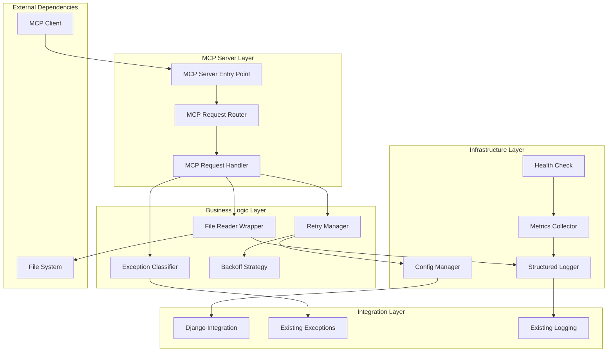

# Архитектура MCP-сервера для обработки ошибок чтения файлов

## 1. Обзор решения

### 1.1. Назначение
MCP-сервер (Model Context Protocol) предназначен для обеспечения отказоустойчивого чтения файлов с автоматическим механизмом повтора и обработки исключений. Сервер интегрируется с существующей Django-системой и предоставляет инструменты через MCP протокол.

### 1.2. Ключевые проблемы, которые решает MCP-сервер
- Периодические ошибки при чтении файлов через `read_file` в среде Kilo Code
- Необходимость автоматического повтора при временных ошибках
- Отсутствие централизованной обработки исключений файловых операций
- Необходимость структурированного логирования всех попыток чтения

### 1.3. Цели архитектуры
- **Отказоустойчивость**: Автоматический повтор операций при временных ошибках
- **Масштабируемость**: Поддержка асинхронных операций для высокой производительности
- **Наблюдаемость**: Полное структурированное логирование всех операций
- **Конфигурируемость**: Гибкая настройка параметров retry и обработки ошибок
- **Совместимость**: Интеграция с существующей Django-системой и MCP протоколом

---

## 2. Анализ существующего кода

### 2.1. Компоненты для переиспользования

#### 2.1.1. Система исключений (`backend/core/exceptions.py`)
**Что можно использовать:**
- Базовый класс `BaseAppException` с полями `message`, `error_code`, `status_code`, `details`
- Метод `to_dict()` для преобразования в API-ответ
- Иерархия исключений (DomainException, InfrastructureException)

**Требуемые расширения:**
- Новый подкласс `FileReadException` для специфических ошибок чтения файлов
- Подклассы для различных типов файловых ошибок:
  - `FileNotFoundReadException`
  - `FilePermissionException`
  - `FileIOReadException`
  - `FileLockedException`

#### 2.1.2. Система логирования (`backend/core/logging.py`)
**Что можно использовать:**
- Класс `StructuredLogger` для структурированного JSON логирования
- Контекстные переменные `trace_id_var` и `user_id_var`
- Класс `StructuredFormatter` для форматирования логов

**Требуемые расширения:**
- Специфические event types для файловых операций:
  - `file_read_attempt`
  - `file_read_success`
  - `file_read_retry`
  - `file_read_failure`
  - `file_read_degraded`

#### 2.1.3. Обработчик исключений (`backend/core/exceptions_handler.py`)
**Что можно использовать:**
- Паттерн централизованной обработки исключений
- Интеграция с trace_id и user_id из контекста

**Требуемые расширения:**
- Обработка новых файловых исключений
- Graceful degradation для MCP-сервера

### 2.2. Проблемы в существующем коде

#### 2.2.1. `backend/core/safe_file_reader.py`
**Проблемы:**
- Импортирует несуществующий модуль `retry_handler` (строка 9)
- Декоратор `@retry_with_exponential_backoff()` не реализован
- Отсутствует асинхронная поддержка
- Нет интеграции с MCP протоколом

**Решение:**
- Полная переработка для MCP-сервера
- Реализация собственного retry механизма
- Добавление async/await поддержки
- Интеграция с MCP протоколом

---

## 3. Архитектура MCP-сервера

### 3.1. Компонентная диаграмма



### 3.2. Поток данных

```mermaid
sequenceDiagram
    participant Client as MCP Client
    participant Server as MCP Server
    participant Router as MCP Router
    participant Handler as Request Handler
    participant Retry as Retry Manager
    participant Reader as File Reader
    participant Classifier as Exception Classifier
    participant Logger as Structured Logger
    participant FS as File System
    
    Client->>Server: read_file_request
    Server->>Router: route_request
    Router->>Handler: handle_request
    
    Handler->>Logger: log_attempt
    Handler->>Retry: execute_with_retry
    
    loop Retry Loop
        Retry->>Reader: read_file
        Reader->>FS: open/read
        alt Success
            FS-->>Reader: content
            Reader-->>Retry: success
            Retry-->>Handler: result
            Handler->>Logger: log_success
            Handler-->>Server: response
            Server-->>Client: success_response
        else Temporary Error
            FS--x>>Reader: exception
            Reader->>Classifier: classify_exception
            Classifier-->>Retry: retryable
            Retry->>Retry: calculate_backoff
            Retry->>Logger: log_retry
        else Permanent Error
            FS--x>>Reader: exception
            Reader->>Classifier: classify_exception
            Classifier-->>Retry: not_retryable
            Retry->>Logger: log_failure
            Retry-->>Handler: degraded_result
            Handler-->>Server: degraded_response
            Server-->>Client: degraded_response
        end
    end
```

---

## 4. Детальное описание компонентов

### 4.1. MCP Server Entry Point

**Назначение:** Точка входа для MCP-клиентов, обрабатывающая входящие запросы.

**Ответственности:**
- Инициализация MCP-сервера
- Регистрация инструментов (tools) и ресурсов (resources)
- Управление жизненным циклом сервера
- Обработка соединений с MCP-клиентами

**Интерфейс:**
```python
class MCPServer:
    async def initialize(self, config: MCPConfig) -> None
    async def start(self) -> None
    async def stop(self) -> None
    async def handle_request(self, request: MCPRequest) -> MCPResponse
```

### 4.2. MCP Request Router

**Назначение:** Маршрутизация входящих MCP-запросов к соответствующим обработчикам.

**Ответственности:**
- Парсинг MCP-запросов
- Валидация запросов
- Маршрутизация к обработчикам инструментов
- Формирование MCP-ответов

**Интерфейс:**
```python
class MCPRequestRouter:
    def register_tool(self, tool_name: str, handler: Callable) -> None
    def register_resource(self, resource_name: str, handler: Callable) -> None
    async def route(self, request: MCPRequest) -> MCPResponse
```

### 4.3. MCP Request Handler

**Назначение:** Обработка конкретных MCP-запросов для файловых операций.

**Ответственности:**
- Обработка запросов `read_file`
- Обработка запросов `read_file_lines`
- Обработка запросов `read_json_file`
- Обработка запросов `batch_read_files`
- Обработка запросов `file_exists`
- Обработка запросов `get_file_size`

**Интерфейс:**
```python
class MCPRequestHandler:
    async def handle_read_file(self, params: ReadFileParams) -> MCPResponse
    async def handle_read_file_lines(self, params: ReadFileLinesParams) -> MCPResponse
    async def handle_read_json_file(self, params: ReadJSONFileParams) -> MCPResponse
    async def handle_batch_read_files(self, params: BatchReadFilesParams) -> MCPResponse
    async def handle_file_exists(self, params: FileExistsParams) -> MCPResponse
    async def handle_get_file_size(self, params: GetFileSizeParams) -> MCPResponse
```

### 4.4. Retry Manager

**Назначение:** Управление механизмом повтора операций с экспоненциальной задержкой.

**Ответственности:**
- Управление количеством попыток
- Расчет задержки между попытками (exponential backoff)
- Отслеживание состояния попыток
- Принятие решения о продолжении или прекращении retry

**Интерфейс:**
```python
class RetryManager:
    async def execute_with_retry(
        self,
        operation: Callable,
        config: RetryConfig,
        context: RetryContext
    ) -> RetryResult
    
    def should_retry(self, exception: Exception, attempt: int) -> bool
    
    def calculate_backoff(self, attempt: int, base_delay: float) -> float
```

**Конфигурация:**
```python
@dataclass
class RetryConfig:
    max_attempts: int = 3
    base_delay: float = 1.0  # секунды
    max_delay: float = 60.0  # секунды
    exponential_base: float = 2.0
    jitter: bool = True
    jitter_factor: float = 0.1
    
@dataclass
class RetryContext:
    operation_name: str
    file_path: str
    attempt: int = 0
    start_time: float = 0.0
    last_exception: Optional[Exception] = None
```

### 4.5. Exception Classifier

**Назначение:** Классификация исключений для определения возможности повтора.

**Ответственности:**
- Определение retryable исключений
- Определение non-retryable исключений
- Преобразование стандартных исключений в доменные
- Предоставление рекомендаций по обработке

**Интерфейс:**
```python
class ExceptionClassifier:
    def classify(self, exception: Exception) -> ExceptionClassification
    
    def is_retryable(self, exception: Exception) -> bool
    
    def to_domain_exception(self, exception: Exception) -> BaseAppException
```

**Классификация исключений:**

| Тип исключения | Retryable | Причина | Доменное исключение |
|----------------|-----------|---------|---------------------|
| `FileNotFoundError` | Нет | Файл не существует | `FileNotFoundReadException` |
| `PermissionError` | Нет | Нет прав доступа | `FilePermissionException` |
| `IOError` (временный) | Да | Временная ошибка I/O | `FileIOReadException` |
| `OSError` (временный) | Да | Временная ошибка ОС | `FileIOReadException` |
| `BlockingIOError` | Да | Файл заблокирован | `FileLockedException` |
| `TimeoutError` | Да | Тайм-аут операции | `FileIOReadException` |
| `json.JSONDecodeError` | Нет | Ошибка парсинга JSON | `FileParseReadException` |
| `UnicodeDecodeError` | Нет | Ошибка кодировки | `FileEncodingReadException` |

### 4.6. File Reader Wrapper

**Назначение:** Обертка над стандартными операциями чтения файлов с интеграцией retry механизма.

**Ответственности:**
- Безопасное чтение файлов
- Чтение JSON файлов
- Построчное чтение
- Проверка существования файлов
- Получение размера файла
- Интеграция с RetryManager

**Интерфейс:**
```python
class FileReaderWrapper:
    async def read_file(
        self,
        file_path: str,
        encoding: str = 'utf-8',
        retry_config: Optional[RetryConfig] = None
    ) -> FileReadResult
    
    async def read_json_file(
        self,
        file_path: str,
        retry_config: Optional[RetryConfig] = None
    ) -> FileReadResult
    
    async def read_file_lines(
        self,
        file_path: str,
        encoding: str = 'utf-8',
        retry_config: Optional[RetryConfig] = None
    ) -> FileReadResult
    
    async def file_exists(
        self,
        file_path: str,
        retry_config: Optional[RetryConfig] = None
    ) -> FileReadResult
    
    async def get_file_size(
        self,
        file_path: str,
        retry_config: Optional[RetryConfig] = None
    ) -> FileReadResult
```

**Результаты:**
```python
@dataclass
class FileReadResult:
    success: bool
    content: Optional[Any] = None
    error: Optional[BaseAppException] = None
    attempts: int = 0
    total_time: float = 0.0
    degraded: bool = False
    metadata: Dict[str, Any] = field(default_factory=dict)
```

### 4.7. Backoff Strategy

**Назначение:** Стратегия расчета задержки между попытками.

**Типы стратегий:**

1. **Exponential Backoff** - экспоненциальная задержка
   - Формула: `delay = base_delay * (exponential_base ** attempt)`
   - Ограничение: `min(delay, max_delay)`

2. **Exponential Backoff with Jitter** - с добавлением случайности
   - Формула: `delay = base_delay * (exponential_base ** attempt) * (1 ± jitter_factor)`

3. **Linear Backoff** - линейная задержка
   - Формула: `delay = base_delay * attempt`

4. **Fixed Backoff** - фиксированная задержка
   - Формула: `delay = base_delay`

**Интерфейс:**
```python
class BackoffStrategy(ABC):
    @abstractmethod
    def calculate_delay(self, attempt: int, config: RetryConfig) -> float:
        pass

class ExponentialBackoff(BackoffStrategy):
    def calculate_delay(self, attempt: int, config: RetryConfig) -> float:
        delay = config.base_delay * (config.exponential_base ** attempt)
        delay = min(delay, config.max_delay)
        
        if config.jitter:
            jitter_amount = delay * config.jitter_factor
            delay += random.uniform(-jitter_amount, jitter_amount)
        
        return max(0, delay)
```

### 4.8. Config Manager

**Назначение:** Управление конфигурацией MCP-сервера.

**Ответственности:**
- Загрузка конфигурации из файлов
- Валидация конфигурации
- Предоставление конфигурации компонентам
- Горячая перезагрузка конфигурации (опционально)

**Интерфейс:**
```python
class ConfigManager:
    def load_config(self, config_path: str) -> MCPConfig
    
    def get_retry_config(self, operation: str) -> RetryConfig
    
    def get_logging_config(self) -> LoggingConfig
    
    def validate_config(self, config: MCPConfig) -> bool
```

**Структура конфигурации:**
```yaml
# mcp_server_config.yaml
server:
  name: "file_reader_mcp_server"
  version: "1.0.0"
  host: "localhost"
  port: 8080
  
retry:
  default:
    max_attempts: 3
    base_delay: 1.0
    max_delay: 60.0
    exponential_base: 2.0
    jitter: true
    jitter_factor: 0.1
  
  read_file:
    max_attempts: 5
    base_delay: 0.5
    max_delay: 30.0
    
  read_json_file:
    max_attempts: 3
    base_delay: 1.0
    max_delay: 60.0

logging:
  level: "INFO"
  format: "json"
  include_trace_id: true
  include_user_id: true
  
health_check:
  enabled: true
  interval: 60  # секунды
  timeout: 10   # секунды
  
metrics:
  enabled: true
  collect_attempts: true
  collect_errors: true
  collect_performance: true
```

### 4.9. Structured Logger

**Назначение:** Структурированное логирование операций MCP-сервера.

**Ответственности:**
- Логирование всех попыток чтения
- Логирование успешных операций
- Логирование retry попыток
- Логирование ошибок и исключений
- Логирование метрик производительности

**Event Types:**
```python
# Файловые операции
FILE_READ_ATTEMPT = "file_read_attempt"
FILE_READ_SUCCESS = "file_read_success"
FILE_READ_RETRY = "file_read_retry"
FILE_READ_FAILURE = "file_read_failure"
FILE_READ_DEGRADED = "file_read_degraded"

# MCP операции
MCP_REQUEST_RECEIVED = "mcp_request_received"
MCP_REQUEST_PROCESSED = "mcp_request_processed"
MCP_REQUEST_ERROR = "mcp_request_error"

# Системные операции
SERVER_STARTED = "server_started"
SERVER_STOPPED = "server_stopped"
HEALTH_CHECK_PASSED = "health_check_passed"
HEALTH_CHECK_FAILED = "health_check_failed"
```

**Формат лога:**
```json
{
  "timestamp": "2026-01-20T15:53:15.495Z",
  "level": "INFO",
  "logger": "mcp_server.file_reader",
  "event_type": "file_read_success",
  "trace_id": "abc123-def456-ghi789",
  "user_id": "user_123",
  "extra": {
    "operation": "read_file",
    "file_path": "/path/to/file.txt",
    "attempts": 2,
    "total_time": 1.234,
    "file_size": 1024,
    "encoding": "utf-8"
  }
}
```

### 4.10. Health Check

**Назначение:** Мониторинг состояния MCP-сервера.

**Ответственности:**
- Проверка доступности файловой системы
- Проверка доступности конфигурации
- Проверка работоспособности логирования
- Сбор метрик состояния

**Интерфейс:**
```python
class HealthCheck:
    async def check_health(self) -> HealthStatus
    
    async def check_filesystem(self) -> ComponentHealth
    
    async def check_configuration(self) -> ComponentHealth
    
    async def check_logging(self) -> ComponentHealth
```

**Статус здоровья:**
```python
@dataclass
class HealthStatus:
    healthy: bool
    status: str  # "healthy", "degraded", "unhealthy"
    components: Dict[str, ComponentHealth]
    timestamp: float
    uptime: float

@dataclass
class ComponentHealth:
    name: str
    healthy: bool
    message: str
    details: Dict[str, Any]
```

### 4.11. Metrics Collector

**Назначение:** Сбор метрик производительности и использования MCP-сервера.

**Ответственности:**
- Сбор метрик попыток чтения
- Сбор метрик ошибок
- Сбор метрик производительности
- Агрегация метрик
- Экспорт метрик (опционально)

**Метрики:**
```python
@dataclass
class ServerMetrics:
    total_requests: int
    successful_requests: int
    failed_requests: int
    degraded_requests: int
    total_retries: int
    average_attempts_per_request: float
    average_response_time: float
    error_rate: float
    uptime: float
    
    # Метрики по операциям
    operation_metrics: Dict[str, OperationMetrics]
    
    # Метрики по типам ошибок
    error_metrics: Dict[str, ErrorMetrics]

@dataclass
class OperationMetrics:
    operation_name: str
    total_requests: int
    successful: int
    failed: int
    degraded: int
    total_retries: int
    average_attempts: float
    average_time: float

@dataclass
class ErrorMetrics:
    error_type: str
    count: int
    last_occurrence: float
    affected_files: List[str]
```

---

## 5. Интеграция с существующей Django-системой

### 5.1. Точки интеграции

#### 5.1.1. Исключения
**Расширение `backend/core/exceptions.py`:**
```python
# Новые исключения для файловых операций
class FileReadException(InfrastructureException):
    """Базовый класс для исключений чтения файлов."""
    def __init__(self, message: str, file_path: str, **details):
        super().__init__(
            message=message,
            error_code="FILE_READ_ERROR",
            details={"file_path": file_path, **details}
        )

class FileNotFoundReadException(FileReadException):
    """Файл не найден."""
    def __init__(self, file_path: str):
        super().__init__(
            message=f"File not found: {file_path}",
            file_path=file_path
        )

class FilePermissionException(FileReadException):
    """Нет прав доступа к файлу."""
    def __init__(self, file_path: str):
        super().__init__(
            message=f"Permission denied: {file_path}",
            file_path=file_path
        )

class FileIOReadException(FileReadException):
    """Ошибка I/O при чтении файла."""
    def __init__(self, file_path: str, original_error: str):
        super().__init__(
            message=f"I/O error reading file: {file_path}",
            file_path=file_path,
            original_error=original_error
        )

class FileLockedException(FileReadException):
    """Файл заблокирован."""
    def __init__(self, file_path: str):
        super().__init__(
            message=f"File is locked: {file_path}",
            file_path=file_path
        )

class FileParseReadException(FileReadException):
    """Ошибка парсинга файла."""
    def __init__(self, file_path: str, parse_error: str):
        super().__init__(
            message=f"Parse error in file: {file_path}",
            file_path=file_path,
            parse_error=parse_error
        )

class FileEncodingReadException(FileReadException):
    """Ошибка кодировки файла."""
    def __init__(self, file_path: str, encoding: str):
        super().__init__(
            message=f"Encoding error in file: {file_path}",
            file_path=file_path,
            encoding=encoding
        )
```

#### 5.1.2. Логирование
**Расширение `backend/core/logging.py`:**
```python
# Новые event types для файловых операций
FILE_READ_ATTEMPT = "file_read_attempt"
FILE_READ_SUCCESS = "file_read_success"
FILE_READ_RETRY = "file_read_retry"
FILE_READ_FAILURE = "file_read_failure"
FILE_READ_DEGRADED = "file_read_degraded"

# Новые helper методы для StructuredLogger
class StructuredLogger:
    # ... существующие методы ...
    
    def log_file_read_attempt(
        self,
        file_path: str,
        operation: str,
        **kwargs
    ) -> None:
        """Логировать попытку чтения файла."""
        self.info(
            FILE_READ_ATTEMPT,
            file_path=file_path,
            operation=operation,
            **kwargs
        )
    
    def log_file_read_success(
        self,
        file_path: str,
        operation: str,
        attempts: int,
        total_time: float,
        **kwargs
    ) -> None:
        """Логировать успешное чтение файла."""
        self.info(
            FILE_READ_SUCCESS,
            file_path=file_path,
            operation=operation,
            attempts=attempts,
            total_time=total_time,
            **kwargs
        )
    
    def log_file_read_retry(
        self,
        file_path: str,
        operation: str,
        attempt: int,
        exception: Exception,
        next_delay: float,
        **kwargs
    ) -> None:
        """Логировать retry попытку."""
        self.warning(
            FILE_READ_RETRY,
            file_path=file_path,
            operation=operation,
            attempt=attempt,
            exception_type=type(exception).__name__,
            exception_message=str(exception),
            next_delay=next_delay,
            **kwargs
        )
    
    def log_file_read_failure(
        self,
        file_path: str,
        operation: str,
        attempts: int,
        exception: BaseAppException,
        **kwargs
    ) -> None:
        """Логировать неудачное чтение файла."""
        self.error(
            FILE_READ_FAILURE,
            file_path=file_path,
            operation=operation,
            attempts=attempts,
            error_code=exception.error_code,
            error_message=exception.message,
            **kwargs
        )
    
    def log_file_read_degraded(
        self,
        file_path: str,
        operation: str,
        attempts: int,
        fallback_value: Any,
        **kwargs
    ) -> None:
        """Логировать degraded результат."""
        self.warning(
            FILE_READ_DEGRADED,
            file_path=file_path,
            operation=operation,
            attempts=attempts,
            fallback_value=str(fallback_value),
            **kwargs
        )
```

### 5.2. Миграционная стратегия

#### 5.2.1. Этап 1: Подготовка (неделя 1)
- Создание структуры директорий MCP-сервера
- Расширение системы исключений
- Расширение системы логирования
- Подготовка конфигурационных файлов

#### 5.2.2. Этап 2: Разработка ядра (неделя 2)
- Реализация RetryManager
- Реализация ExceptionClassifier
- Реализация BackoffStrategy
- Реализация ConfigManager

#### 5.2.3. Этап 3: Разработка MCP-сервера (неделя 3)
- Реализация MCPServer
- Реализация MCPRequestRouter
- Реализация MCPRequestHandler
- Реализация FileReaderWrapper

#### 5.2.4. Этап 4: Интеграция и тестирование (неделя 4)
- Интеграция с Django-системой
- Написание unit-тестов
- Написание integration-тестов
- Нагрузочное тестирование

#### 5.2.5. Этап 5: Развертывание (неделя 5)
- Подготовка production конфигурации
- Развертывание в staging
- Мониторинг и отладка
- Развертывание в production

---

## 6. Graceful Degradation

### 6.1. Стратегии graceful degradation

#### 6.1.1. Возврат значений по умолчанию
```python
# Пример: для file_exists вернуть False
@dataclass
class FileReadResult:
    success: bool
    content: Optional[Any] = None
    error: Optional[BaseAppException] = None
    attempts: int = 0
    total_time: float = 0.0
    degraded: bool = False
    fallback_used: bool = False
    metadata: Dict[str, Any] = field(default_factory=dict)
```

#### 6.1.2. Кэширование последних успешных результатов
```python
class CachedFileReader:
    def __init__(self, cache_ttl: int = 300):  # 5 минут
        self.cache = {}
        self.cache_ttl = cache_ttl
    
    async def read_file(self, file_path: str) -> FileReadResult:
        # Попытка чтения с retry
        result = await self.file_reader.read_file(file_path)
        
        if result.success:
            # Кэширование успешного результата
            self.cache[file_path] = {
                'content': result.content,
                'timestamp': time.time()
            }
        else:
            # Попытка вернуть кэшированное значение
            cached = self.cache.get(file_path)
            if cached and time.time() - cached['timestamp'] < self.cache_ttl:
                result.content = cached['content']
                result.degraded = True
                result.fallback_used = True
        
        return result
```

#### 6.1.3. Частичный успех для batch операций
```python
async def batch_read_files(self, file_paths: List[str]) -> Dict[str, FileReadResult]:
    results = {}
    
    for file_path in file_paths:
        try:
            result = await self.read_file(file_path)
            results[file_path] = result
        except Exception as e:
            # Продолжаем обработку других файлов даже при ошибке
            results[file_path] = FileReadResult(
                success=False,
                error=FileIOReadException(file_path, str(e)),
                degraded=True
            )
    
    return results
```

### 6.2. Уровни degradation

| Уровень | Описание | Действия |
|---------|----------|----------|
| **Level 0: No Degradation** | Полная функциональность | Все операции работают нормально |
| **Level 1: Retry Degradation** | Retry с увеличенным количеством попыток | Увеличить max_attempts, base_delay |
| **Level 2: Cache Degradation** | Использование кэша при ошибках | Возврат кэшированных значений |
| **Level 3: Fallback Degradation** | Возврат значений по умолчанию | Использовать fallback значения |
| **Level 4: Partial Degradation** | Частичная функциональность | Отключить некоторые операции |
| **Level 5: Full Degradation** | Минимальная функциональность | Только базовые операции |

---

## 7. Безопасность

### 7.1. Валидация путей файлов

**Защита от Path Traversal:**
```python
class PathValidator:
    ALLOWED_BASE_DIRS = [
        "/var/www/uploads",
        "/home/user/documents",
        # ... другие разрешенные директории
    ]
    
    def validate_path(self, file_path: str) -> bool:
        # Нормализация пути
        normalized_path = os.path.normpath(file_path)
        
        # Проверка на path traversal
        if ".." in normalized_path:
            return False
        
        # Проверка, что путь находится в разрешенной директории
        for base_dir in self.ALLOWED_BASE_DIRS:
            if normalized_path.startswith(base_dir):
                return True
        
        return False
```

### 7.2. Ограничение размера файлов

```python
class FileReaderWrapper:
    MAX_FILE_SIZE = 10 * 1024 * 1024  # 10 MB
    
    async def read_file(self, file_path: str, **kwargs) -> FileReadResult:
        # Проверка размера файла перед чтением
        size = await self.get_file_size(file_path)
        
        if size > self.MAX_FILE_SIZE:
            return FileReadResult(
                success=False,
                error=FileIOReadException(
                    file_path,
                    f"File size {size} exceeds maximum allowed size {self.MAX_FILE_SIZE}"
                ),
                degraded=False
            )
        
        # ... продолжение чтения
```

### 7.3. Лимиты частоты запросов

```python
class RateLimiter:
    def __init__(self, max_requests: int = 100, window: int = 60):
        self.max_requests = max_requests
        self.window = window
        self.requests = {}
    
    async def check_rate_limit(self, client_id: str) -> bool:
        now = time.time()
        
        # Удаление старых запросов
        self.requests[client_id] = [
            req_time for req_time in self.requests.get(client_id, [])
            if now - req_time < self.window
        ]
        
        # Проверка лимита
        if len(self.requests[client_id]) >= self.max_requests:
            return False
        
        self.requests[client_id].append(now)
        return True
```

---

## 8. Мониторинг и метрики

### 8.1. Ключевые метрики

#### 8.1.1. Метрики производительности
- **Average Response Time**: Среднее время ответа
- **P50 Response Time**: 50-й перцентиль времени ответа
- **P95 Response Time**: 95-й перцентиль времени ответа
- **P99 Response Time**: 99-й перцентиль времени ответа
- **Throughput**: Количество запросов в секунду

#### 8.1.2. Метрики надежности
- **Success Rate**: Процент успешных запросов
- **Error Rate**: Процент ошибок
- **Degraded Rate**: Просят degraded запросов
- **Retry Rate**: Среднее количество retry на запрос
- **Availability**: Время доступности сервера

#### 8.1.3. Метрики использования
- **Total Requests**: Общее количество запросов
- **Requests per Operation**: Количество запросов по операциям
- **Average File Size**: Средний размер прочитанных файлов
- **Cache Hit Rate**: Процент попаданий в кэш

### 8.2. Alerting

**Критические alerts:**
- Error Rate > 5% за 5 минут
- P95 Response Time > 10 секунд
- Server unavailable > 1 минуты
- Disk space < 10%

**Предупреждающие alerts:**
- Error Rate > 1% за 5 минут
- P95 Response Time > 5 секунд
- Retry Rate > 2 на запрос
- Cache Hit Rate < 50%

---

## 9. Резюме архитектуры

### 9.1. Ключевые преимущества

1. **Отказоустойчивость**: Автоматический retry с exponential backoff
2. **Масштабируемость**: Асинхронная поддержка для высокой производительности
3. **Наблюдаемость**: Полное структурированное логирование и метрики
4. **Конфигурируемость**: Гибкая настройка через YAML конфигурацию
5. **Graceful Degradation**: Многоуровневая стратегия деградации
6. **Безопасность**: Валидация путей, ограничение размеров, rate limiting
7. **Совместимость**: Интеграция с существующей Django-системой
8. **MCP совместимость**: Полная поддержка MCP протокола

### 9.2. Технологический стек

- **Язык**: Python 3.8+
- **Асинхронность**: asyncio
- **Конфигурация**: YAML (PyYAML)
- **Логирование**: JSON структурированное логирование
- **Протокол**: Model Context Protocol (MCP)
- **Интеграция**: Django

### 9.3. Следующие шаги

1. Утверждение архитектуры
2. Создание детальной технической спецификации
3. Разработка прототипа
4. Интеграционное тестирование
5. Развертывание в production
